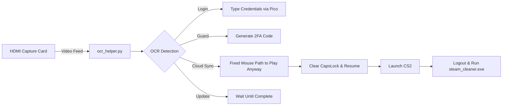

**Author:** M. Bilal  
**Contact:** bilalrajput031@gmail.com
#  Steam Login & CS2 Launcher Automation  
**(Raspberry Pi Pico + OCR + HID Control)**

Automates the full **Steam login → Steam Guard → CS2 launch → metadata cleanup** pipeline using:  
a **Raspberry Pi Pico** (as USB HID), **OpenCV + Tesseract OCR** for screen recognition,  
and a **Linux host** controlling a **Windows target PC** — *no human input required.*

---

## Table of Contents
- [Overview](#overview)
- [System Architecture](#system-architecture)
- [Features](#features)
- [Hardware Setup](#hardware-setup)
- [Software Requirements](#software-requirements)
- [Virtual Environment Setup (venv)](#virtual-environment-setup-venv)
- [Installation & Setup](#installation--setup)
- [Configuration](#configuration)
- [Running the Automation](#running-the-automation)
- [Main Workflow](#main-workflow)
- [Logout & Metadata Cleanup](#logout--metadata-cleanup)
- [Module Reference](#module-reference)
- [Mouse Test & Calibration](#mouse-test--calibration)
- [Developer Notes](#developer-notes)
- [Directory Layout](#directory-layout)
- [Troubleshooting](#troubleshooting)
- [Cleanup Logic](#cleanup-logic)
- [End-to-End Flow Summary](#end-to-end-flow-summary)

---

##  Overview

This project enables **hands-free Steam login and CS2 automation** using:

- A **Raspberry Pi Pico** acting as a USB keyboard and mouse (HID)
- A **Linux host** running Python-based automation with OCR
- An **HDMI capture card** for real-time screen recognition

The automation uses **OpenCV** for image processing and **Tesseract OCR** for text recognition, allowing the system to visually detect states (login, guard, popups) and respond automatically with keyboard/mouse actions via the Pico.


---

## ⚙️ System Architecture



---

##  Features

Automatic Steam Login — Detects login screen and types credentials
Steam Guard Handling — Generates and types 2FA codes
Popup Detection — Handles “Play Anyway”, “Cloud Sync”, and “Update Required”
Mouse Control via HID — Performs automated mouse clicks
Metadata Cleanup — Removes cached Steam files on logout
Debug Capture — Saves OCR snapshots for analysis
Dual Mode — Run full automation or cleanup-only mode

---

## 🔌 Hardware Setup

| Component | Description |
|------------|-------------|
| **Raspberry Pi Pico** | TinyUSB HID firmware (mouse + keyboard) |
| **Windows Target PC** | Steam + CS2 installed |
| **Linux Host PC** | Runs automation scripts |
| **HDMI Capture Card** | Captures video output |
| **Serial USB** | `/dev/ttyUSB0` |

---
## Virtual Environment Setup (venv)
Create and activate virtual environment:
```bash
python3 -m venv venv
source venv/bin/activate   # on Linux
venv\Scripts\activate    # on Windows
pip install -r requirements.txt

## Run Modes
| Mode | Command |
|------|----------|
| Full automation | `python3 main.py` |
| Logout & metadata cleanup | `python3 main.py --logout-only` |
| Mouse test | `python3 mouse_test.py --screen 1920x1080` |

The logout mode (`--logout-only`) clears Steam cache, metadata, and runs `steam_cleaner.exe` on the target PC automatically.


##  Software Requirements

### 🖥️ Linux Host
```bash
sudo apt update
sudo apt install python3-opencv python3-pip tesseract-ocr
pip install pyserial pytesseract
```

### 💻 Windows Target
- Steam installed at `C:\Program Files (x86)\Steam`
- CS2 installed
- Place **steam_cleaner.exe** on Desktop  
  (auto-invoked during `--logout-only` cleanup)

---

## ⚙️ Installation & Setup

Connect Pico:
```bash
ls /dev/ttyUSB*
```

Test communication:
```bash
python3 sender_final.py
```

---

##  Configuration

### `defines.py`
```python
USERNAME = "your_steam_username"
PASSWORD = "your_steam_password"
DEVICE = "/dev/video2"
WIDTH, HEIGHT = 1920, 1080
```

### `guard_code.py`
```python
SHARED_SECRET = "your_steam_shared_secret"
```

Or set dynamically:
```bash
export STEAM_SHARED_SECRET="your_shared_secret"
```

---

## ▶ Running the Automation

| Mode | Description | Command |
|------|--------------|----------|
| 🔄 Full Login | Auto login, Guard, popup click, CS2 launch | `python3 main.py` |
| 🚪 Logout & Cleanup | Manual call for cleanup | `python3 main.py --logout-only` |
| 🖱️ Mouse Test | Move test | `python3 mouse_test.py --screen 1920x1080` |

---

## Main Workflow

1. Detect Steam login screen  
2. Enter credentials  
3. Generate & enter Guard code  
4. Handle popups (“Play Anyway”, “Update”)  
5. Launch CS2  
6. Clear CapsLock  
7. Wait for updates  
8. (Manual) Logout & cleanup

---

##  Logout & Metadata Cleanup

Manual run:
```bash
python3 main.py --logout-only
```
Performs Steam shutdown + metadata cleanup via:
```bash
"C:\Users\<YourUser>\Desktop\steam_cleaner.exe"
```

Update `<YourUser>` path before running.

---

##  Module Reference

| File | Role |
|------|------|
| main.py | Core workflow (OCR + HID) |
| ocr_helper.py | Capture & text recognition |
| guard_code.py | Steam Guard generator |
| defines.py | Constants/configs |
| sender_final.py | Pico serial HID |
| mouse_test.py | Position calibration |
| clear_caps.py | Resets CapsLock |

---

##  Mouse Test
```bash
python3 mouse_test.py --screen 1920x1080 --start 1 1 down 475 right 750 click
```

Steps:
1. Move to top-left  
2. Down 475px  
3. Right 750px  
4. Click

---

## Developer Notes

- Set `TEST_WRONG_GUARD = True` to simulate invalid code.
- Adjust click coordinates in `handle_popup()` for Play Anyway.

---

##  Directory Layout

```
pico_hid_steam_login/
 ┣ main.py
 ┣ defines.py
 ┣ guard_code.py
 ┣ ocr_helper.py
 ┣ sender_final.py
 ┣ clear_caps.py
 ┣ mouse_test.py
 ┗ cap/
```

---

##  Troubleshooting

| Issue | Fix |
|-------|-----|
| No serial | Check `/dev/ttyUSB0` |
| OCR fails | Tune crop area |
| Click offset | Adjust mouse path |
| Wrong Guard | Check shared secret |

---

##  Cleanup Logic

- Removes `loginusers.vdf`, `ssfn*`, `htmlcache/`
- Clears CapsLock after Play Anyway click
- Deletes OCR snapshots automatically

---

##  End-to-End Summary

> Login → Guard → Play Anyway → Launch CS2 →
 Logout → Cleanup → ✅ Done

Hands-free automation — no mouse, no keyboard, no human.

##Recreate venv after cloning
When another user clones your repo:
python3 -m venv venv
source venv/bin/activate
pip install -r requirements.txt

